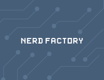

  
  

    

      

        

          <a href="{{ post.url }}">
            <h3 class="mt-0 mb-1">{{ post.title }}</h3>
          </a>
          
{{ post.excerpt }}

          {{ post.author }}
          |
          {{ post.date | date: "%Y-%m-%d" }}
          |
          {{ post.categories }}
        

        
      

    

  

  

